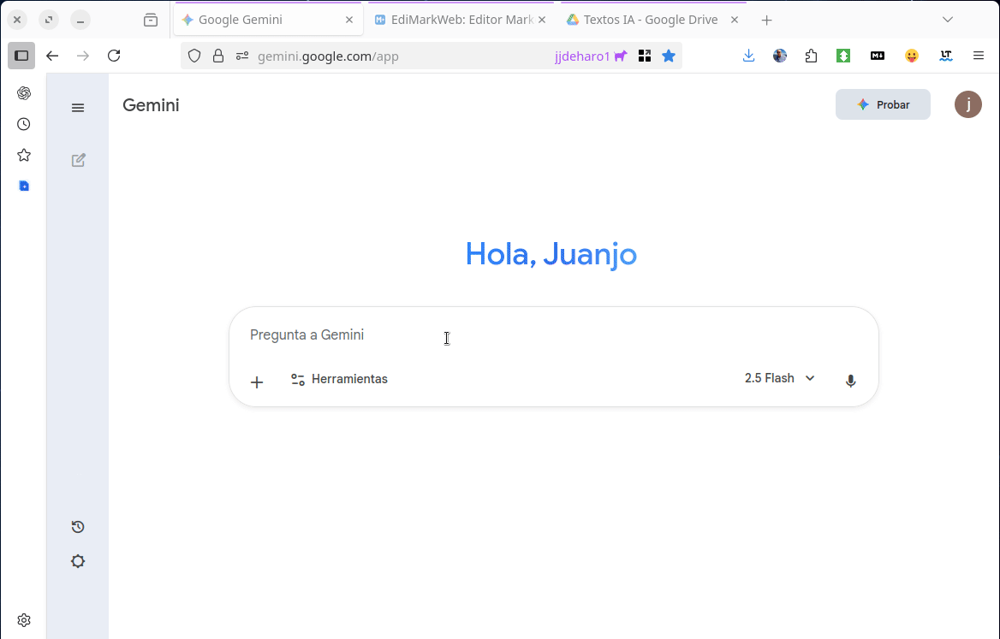
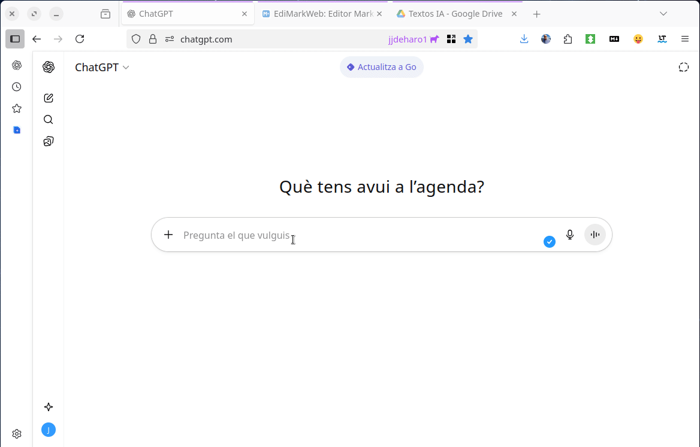

# EdiMarkWeb manual

Welcome to EdiMarkWeb, a **Markdown text editor** designed for teachers and content creators who need to work quickly, export to several formats and add LaTeX maths without complications. Everything runs directly in the browser and your documents are stored safely on your own computer.

## Highlights

- Dual editing: work either in Markdown or straight in the HTML preview, always in sync.
- Export and import menus supporting DOCX, ODT, EPUB, HTML and LaTeX, including options to copy directly to the clipboard.
- Search and replace that highlights matches and ignores accents and letter case.
- A **Settings** menu gathering the language, font size, theme, working width and separate window in one place.
- Interface theme with three options — System, Light and Dark — remembered between sessions.
- Redesigned formula menu and direct access to EdiCuaTeX for building complex expressions.
- Open several files, or whole folders, by dragging them onto the editor (each file in its own tab): Markdown and also DOCX, ODT, EPUB, HTML or TEX, converted on the fly with Pandoc.
- Regular-expression search and a full-screen editing mode for distraction-free work.
- **A language for each document**, stored inside the file itself and shown next to the character counter. All five formats declare it, so Word and LibreOffice stop spell-checking a Spanish text against an English dictionary.
- **Exported document settings** gathered in one place: author, EPUB cover, table of contents, section numbering and, for LaTeX, the class, its options and a preamble of your own.

## Paste anything

> **Important:** you can paste **any object from the clipboard**: plain text, fragments from Word or LibreOffice, full HTML, formulas produced by a chatbot and even images copied directly. Use `Ctrl+V`/`Cmd+V` or the toolbar button with the clipboard icon (`Paste`) and EdiMarkWeb will place the content in the appropriate pane:

- Markdown or unformatted text is inserted in the left pane exactly at the cursor position.
- Rich content (HTML, DOCX, pasted from the browser, etc.) is re-rendered in the right pane and, at the same time, the matching Markdown is generated so both views stay in sync.

This removes any intermediate steps: copy from your source of choice and click **Paste** to carry on editing.

## Videos

The following videos, **without sound and looping**, show some common actions.

### Copying content straight from a chat

You can copy the output of any chat and paste it into EdiMarkWeb to edit, save or export it. This works with any chatbot except ChatGPT, which needs an extra step (see below).



### ChatGPT

ChatGPT no longer uses standard LaTeX, so you have to ask it for the formulas inside a Markdown box. The video also shows how to export to DOCX and upload to Google Drive:



### Writing formulas in EdiMarkWeb


### LaTeX produced by Gemini

When working on a canvas you can ask Gemini for a PDF. That PDF uses LaTeX code you can paste straight into EdiMarkWeb.


---

## Managing documents (tabs)

Work on several documents at once, each in its own tab.

* **New tabs**: press the `+` button (or `Ctrl+T`) to open a blank document.
* **Switching tabs**: click the name to show its contents, or move from one to the next with `Ctrl+Tab`.
* **Renaming**: double-click the title to give it a more descriptive name (e.g. “Unit 3 – Equations”).
* **Closing tabs**: press the `X`. If there are unsaved changes, the application will warn you.
* **Unsaved changes**: a red dot (`●`) marks pending modifications.
* **Autosave**: each tab automatically keeps a copy in your browser; if you reload the page, the content reappears.

---

## Top control bar

The bar next to the logo holds the application's global options and gathers every file action under a single drop-down button:

* **File**: groups the document actions in two families. First the ones that bring content in — `Open (Ctrl+O)`, `Import` and `Paste LaTeX (Ctrl+Shift+V)` — and then the ones that take it out: `Save (Ctrl+S)` and the **Export** submenu, which opens to the right with DOCX, ODT, EPUB, HTML and TEX. Each option shows its keyboard shortcut.
* **Settings**: gathers every application setting, each one in a submenu showing the current value.
  * **Language**: changes the interface language.
  * **Font size**: small, normal, large or very large.
  * **Theme**: `System` follows your computer's setting and changes with it; `Light` and `Dark` fix it. Your choice is remembered next time you open the application.
  * **Expanded width**: widens the working area.
  * **Separate window**: opens EdiMarkWeb in a window of its own, like a desktop application.
  * **Exported document…**: opens the settings for the files the application generates (language, plus class and preamble for LaTeX), explained below.
* **Print (Ctrl+P)**: produces a view ready for paper or PDF using the current styles.
* **Search (Ctrl+F)** and **Manual (Ctrl+H)**: open the advanced search panel or this very document.
* **Clear all**: empties the active document after asking for confirmation.

The pane layout is changed with `Ctrl+L` or with the arrows in each pane's header. On small screens the bar folds into two buttons — **Actions** and **Format** — that show each group when you need it.

---

## Toolbar

The grey strip below the top bar holds quick access to formatting and elements:

* **Undo and redo**: the two arrows at the far left (`Ctrl+Z` and `Ctrl+Shift+Z`).
* **Basic styles**: bold, italic and a headings menu (H1…H6).
* **Lists and quotes**: bullets, numbering and quote blocks with their own shortcuts.
* **Code, links, images and tables**: guided insertion through dialogs.
* **Paste**: brings whatever is on the clipboard into the document, as explained above.
* **LaTeX formulas**: a menu for inserting inline or block commands with the correct syntax.
* **Formula editor (EdiCuaTeX)**: opens the external assistant in a new window. On accepting, the formula comes back inserted in the editor.

Each button shows a description on hover and states the equivalent keyboard shortcut.

---

## Search and replace

The magnifying glass button (or `Ctrl+F`) opens an advanced search panel:

* The search box highlights every match, even if you ignore accents or capitals.
* Use `Enter` to jump to the next match and `Shift+Enter` to go back.
* Press the side arrow to show the replace panel. You can replace matches one by one or all at once (with confirmation).
* The **Regex** button reads what you type as a regular expression. In this mode accents do count (letter case is still ignored) and you can use groups such as `(\d+)`; in the replacement you refer back to them with JavaScript's usual numbered references (a dollar sign followed by the group number).
* The `current / total` counter helps you follow your progress.
* `Esc` closes the search box and returns the focus to the editor.

Search works both in the Markdown view and in the HTML view, depending on where the focus is. While the search box is open the formatting shortcuts are paused, so they don't interfere with what you type in it.

---

## Main interface

The working area is split into two resizable panes:

* **Markdown** (left): a plain text editor with a character counter, the document language indicator and its copy button. Everything you type here is immediately reflected in the right pane.
* **HTML / Preview** (right): shows the final result and also lets you edit the content directly. Use the code icon button to switch between the rich preview and the generated HTML.
* **Copying content**: dedicated buttons to copy the Markdown or the generated HTML (including formulas converted to LaTeX when copying HTML).

You can drag the central bar to give more room to either pane, maximise one of them with the arrows in its header, or use the button to the right of the tabs to **maximise the editing area**, which hides the top bars and leaves the screen to the text.

### Each document's language

Next to the character counter there is a short button with the document language: `ES`, `CA`, `FR`… When it looks dimmed, that document has no language of its own and uses the **general language** from *Settings → Exported document…*, which is the usual case.

Pick a specific language and the application stores it **inside the document itself**, so it travels with the file: save it and open it tomorrow, here or on another computer, or hand it to someone else, and it stays. To go back, choose *General language*. And with *Other language…* you can type the code of any language (`fr`, `de`, `pt-BR`). In that same menu, *This document's author…* does the same for the author.

If you ever open your `.md` in a plain text editor, you will see that preference at the very top, in a few lines between dashes:

```
---
lang: "ca"
---
```

That is the standard way of storing data about a document and many programs understand it. EdiMarkWeb does not show it in the preview, because it is not content, but it does show it in the Markdown pane, which is the source. You can delete or change it by hand if you want.

### Embedded images

When a document carries base64 images — after importing a DOCX, after pasting from another application — their code runs to thousands of characters and makes the Markdown unreadable. EdiMarkWeb folds them away automatically: a short marker such as `__EDIMARK_B64_1__` appears in the editor and, below the pane, a list shows every hidden image with its format, its size and a **View code** button to inspect or copy it. The real content is kept intact when you save, copy or export.

---

## Interactive preview

* Click the right pane to edit the result directly: changes are synced back to the Markdown, keeping the formatting whenever the edit allows it.
* The preview supports selections, copy and paste, and basic shortcuts (Ctrl+B/I, headings, etc.) just like the Markdown editor.
* Hold `Ctrl` (or `Cmd` on macOS) and click to open links in a new browser tab.
* LaTeX formulas are rendered automatically with KaTeX; when you edit them they return to their original syntax.

---

## Main actions

* **Open (`Ctrl+O`)**: imports `.md` or `.markdown` files.
* **Import**: converts documents in other formats to Markdown using Pandoc: `.docx`, `.odt`, `.epub`, `.html` and `.tex`. Headings, lists, tables and links are recovered, and so are the images: when they come from a `.docx`, `.odt` or `.epub` they are extracted from the file itself and embedded in the Markdown, so they show up in the preview and travel with you when exporting.
* **Save (`Ctrl+S`)**: downloads the current document to your computer.
* **Copying content**: the left pane has a button to copy the Markdown; in the preview you can choose what gets copied (rendered HTML or LaTeX variants) from the drop-down next to the copy icon.
* **Clear all**: resets the document after a confirmation.
* **Changing theme, layout or width**: from the **Settings** menu (theme and width) and with `Ctrl+L` (pane layout) you can adapt the interface to each situation: interactive whiteboard, laptop, and so on.
* **Manual**: this document is always available and up to date with `Ctrl+H`.

---

## Exporting

Open the **File** button and choose `Export` to download versions ready to hand in or publish:

* **DOCX (Microsoft Word)**: ideal for sharing with students or colleagues who use Word, and compatible with Google Docs.
* **ODT (LibreOffice)**: intended for free suites such as LibreOffice or OnlyOffice.
* **EPUB (e-book)**: creates an e-book compatible with EPUB 3 readers (Calibre, Apple Books, Thorium, e-ink devices…). The title comes from the first level-1 heading (or from the document name), and the author, the cover and the language come from the settings explained below.
* **HTML (web page)**: produces a self-contained file with embedded styles and formulas, ready to host on the web. The browser tab title comes from the first heading, or from the document name if there is none.
* **TEX (LaTeX)**: creates a complete `.tex` document with a preamble ready to compile. It carries the document language, so hyphenation and the automatic labels come out in your language, and if the document opens with a single level-1 heading that heading becomes the title (`\title` and `\maketitle`) instead of just another section.

While exporting, the top bar shows status messages (progress, success or errors).

### Exported document settings

**Settings → Exported document…** stores preferences that are reused in every export, including the next time you open the application.

**Document language**, which applies to all five formats. It decides which dictionary Word and LibreOffice spell-check a DOCX or an ODT against, how LaTeX hyphenates, and which language HTML and EPUB declare to screen readers. It defaults to **Same as the interface**: change the language of EdiMarkWeb and your documents follow. You can pin any of the five interface languages, or choose **Other…** and type a code (`fr`, `de`, `pt-BR`).

**Author**, stored in the file properties and shown as the book author in the EPUB and on the LaTeX title page. In DOCX and ODT, Pandoc also writes a line with the name at the start of the document; leave the field empty if you would rather it did not appear. A particular document can carry a different author: *This document's author…*, in the language button menu.

**EPUB cover**, with three choices. By default EdiMarkWeb **generates one** from the document title and author, because a book with no image shows up as a generic icon on the reader's shelf. You can use **an image of your own** —up to 1 MB, plenty for a cover: it is stored in the browser, in the same space as your documents— or leave the book **with no cover**. It only affects the EPUB.

**Table of contents**, which adds a list of the sections at the start of the document. In DOCX it is a real Word table of contents and in ODT a native LibreOffice one; the EPUB does not need it, since the reader already provides its navigation index.

> **About page numbers**: in DOCX and ODT the table of contents is a field the word processor calculates, because the pages have to be laid out before it knows where each section falls. EdiMarkWeb writes the list of sections into it, so the document opens with the table of contents visible, but without numbers. To get them, refresh it: in Word, right-click the table of contents → *Update field*; in LibreOffice, *Tools → Update → Indexes*.

**Number the sections**, which puts 1, 1.1, 1.2… before the headings. It works in DOCX, HTML and LaTeX; ODT does not support this numbering and comes out without it.

Plus three **LaTeX only** settings, applied when exporting to TEX and when copying *LaTeX – full document*:

* **Document class**: `article` (the default), `report` or `book`.
* **Class options**: whatever goes in brackets in `\documentclass`, comma separated (`12pt, a4paper`).
* **Preamble**: your packages and macros, inserted verbatim at the end of the preamble, right before `\begin{document}`.

If the document starts with its own YAML metadata, that wins and none of these settings apply. And bear in mind that a faulty preamble raises no warning here: the failure shows up when compiling the `.tex`.

---

## Copying and sharing without downloading

* **Copy Markdown**: a direct button in the left pane sends the source text to the clipboard.
* **Copy from the preview**: the copy button in the right pane remembers your last choice among:
  * *Copy HTML* (rendered exactly as you see it).
  * *Copy LaTeX* (only the current fragment).
  * *Copy LaTeX – full document* (includes preamble and environment ready to compile, with the same language and title as the TEX export).

Each option shows a success notice and, where appropriate, prepares the LaTeX markup automatically from the rendered preview.

---

## Drag and drop files

Drag one or more files onto the application. `.md` and `.markdown` open as they are, while `.docx`, `.odt`, `.epub`, `.html` and `.tex` are converted to Markdown with Pandoc before opening:

* A highlighted frame confirms that you can drop them.
* Each file opens in its own tab, under its original name.
* You can also drag whole folders from your file manager: their subfolders are walked through and every compatible file opens in its own tab, in alphabetical order. Anything else is ignored and, if nothing usable is found, the application tells you.
* The content stays available offline thanks to autosave.

---

## Keyboard shortcuts

| Action | Shortcut (Windows/Linux) | Shortcut (macOS) |
| :--- | :--- | :--- |
| **Formatting** | | |
| Bold | `Ctrl` + `B` | `Cmd` + `B` |
| Italic | `Ctrl` + `I` | `Cmd` + `I` |
| Headings 1-6 | `Ctrl` + `1..6` | `Cmd` + `1..6` |
| Bulleted list | `Ctrl` + `Shift` + `L` | `Cmd` + `Shift` + `L` |
| Numbered list | `Ctrl` + `Shift` + `O` | `Cmd` + `Shift` + `O` |
| Quote | `Ctrl` + `Shift` + `Q` | `Cmd` + `Shift` + `Q` |
| Code | `Ctrl` + `` ` `` | `Cmd` + `` ` `` |
| Link | `Ctrl` + `K` | `Cmd` + `K` |
| Image | `Ctrl` + `Shift` + `I` | `Cmd` + `Shift` + `I` |
| Table | `Ctrl` + `Shift` + `T` | `Cmd` + `Shift` + `T` |
| Inline formula | `Ctrl` + `M` | `Cmd` + `M` |
| Block formula | `Ctrl` + `Shift` + `M` | `Cmd` + `Shift` + `M` |
| Undo / Redo | `Ctrl` + `Z` / `Ctrl` + `Shift` + `Z` | `Cmd` + `Z` / `Cmd` + `Shift` + `Z` |
| **Managing documents** | | |
| New tab | `Ctrl` + `T` | `Cmd` + `T` |
| Close tab | `Ctrl` + `W` | `Cmd` + `W` |
| Next / previous tab | `Ctrl` + `Tab` / `Ctrl` + `Shift` + `Tab` | `Cmd` + `Tab` / `Cmd` + `Shift` + `Tab` |
| Save | `Ctrl` + `S` | `Cmd` + `S` |
| Open file | `Ctrl` + `O` | `Cmd` + `O` |
| Paste LaTeX (open dialog) | `Ctrl` + `Shift` + `V` | `Cmd` + `Shift` + `V` |
| **Interface** | | |
| Change layout | `Ctrl` + `L` | `Cmd` + `L` |
| Search | `Ctrl` + `F` | `Cmd` + `F` |
| Larger / smaller text | `Ctrl` + `+` / `Ctrl` + `-` | `Cmd` + `+` / `Cmd` + `-` |
| Manual | `Ctrl` + `H` | `Cmd` + `H` |
| Reload the manual | `Ctrl` + `Shift` + `H` | `Cmd` + `Shift` + `H` |
| Print | `Ctrl` + `P` | `Cmd` + `P` |

Single-letter shortcuts act on the document, so they are paused while the search box is open.

---

## LaTeX formula examples

### Quadratic formula

To solve a quadratic equation such as $ax^2 + bx + c = 0$, you use:

$$
x = \frac{-b \pm \sqrt{b^2-4ac}}{2a}
$$

### 2x2 matrix

$$
A = \begin{pmatrix}
 a_{11} & a_{12} \\
 a_{21} & a_{22}
\end{pmatrix}
$$

### Other delimiters

As well as `$...$` and `$$...$$`, you can use LaTeX's own delimiters: \(E = mc^2\) inline, and as a block:

\[
\nabla \cdot \vec{E} = \frac{\rho}{\varepsilon_0}
\]

### Sums, limits and integrals

The sum of the first $n$ natural numbers is $\sum_{i=1}^{n} i = \frac{n(n+1)}{2}$ and the integral $\int_0^1 x^2\,dx = \frac{1}{3}$. The number $e$ is defined as a limit:

$$
e = \lim_{n \to \infty} \left(1 + \frac{1}{n}\right)^n
$$

### Systems of equations

$$
\begin{cases}
2x + y = 5 \\
x - y = 1
\end{cases}
$$

### Assorted symbols

Greek letters ($\alpha$, $\beta$, $\Omega$), subscripts ($H_2O$), comparisons ($a \neq b$, $x \leq y$) and sets ($\mathbb{R}$, $A \subseteq B$).

If you prefer to build them visually, select the text in the editor and open **EdiCuaTeX**: the formula will come back inserted automatically.

---

## Ideas for teachers

* **Notes and summaries**: combine text with formulas and links to share them in your virtual classroom.
* **Exams and exercises**: export to DOCX/ODT to print or edit later.
* **Reusable templates**: save documents as self-contained HTML to upload to Moodle, blogs or GitHub Pages.
* **Student work**: invite them to write in Markdown; with autosave they will not lose their progress.

---

## Licence and contributions

EdiMarkWeb is free software under the [GNU Affero General Public License v3.0](LICENSE). This means you can use the application in your classroom, adapt it and deploy it on your own servers, as long as you share any improvements under the same licence and offer the source code to whoever uses your version. If you find a problem or want to propose changes, open an issue on [GitHub](https://github.com/edimarkweb/edimarkweb.github.io/issues) or send a pull request.
